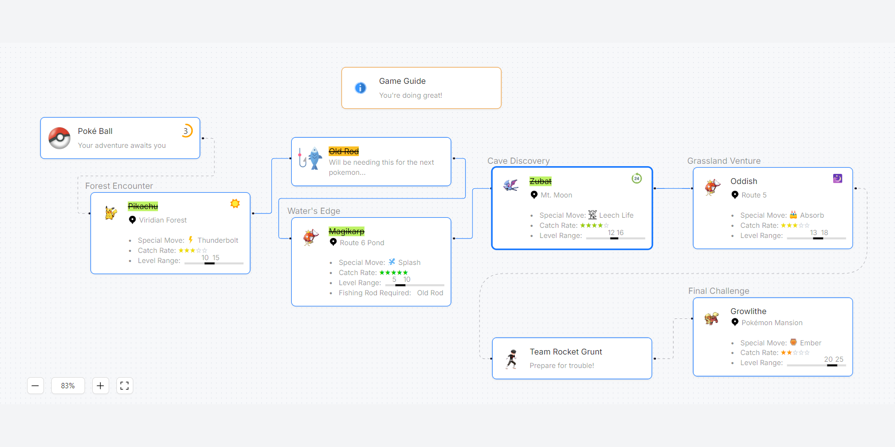

# Pokémon Collector



## Table of Contents

-   [Introduction](#introduction)
-   [Gameplay](#gameplay)
    -   [How to Play](#how-to-play)
    -   [Pokémon Nodes](#pokémon-nodes)
    -   [Items](#items)
    -   [Enemy Node](#enemy-node)
    -   [Tips](#tips)
-   [Getting Started](#getting-started)
    -   [Prerequisites](#prerequisites)
    -   [Installation](#installation)
    -   [Running the Application](#running-the-application)
    -   [Building for Production](#building-for-production)
-   [Features](#features)
-   [Technologies Used](#technologies-used)
-   [Application Structure](#application-structure)
-   [Project Directory](#project-directory)

## Introduction

Welcome to the Pokémon Collector app! This interactive node-based application allows you visualize Pokémon and item collection while engaging with grunts from Team Rocket. Using an intuitive drag-and-drop interface, players must strategically navigate the application map to complete their collection.

## Gameplay


### How To Play

-   **Start Your Journey**: Begin by collecting the Poké Ball.
-   **Collect Pokémon**: Click on Pokémon nodes to collect them.
-   **Collect Items**: Collect items like the _**Old Rod**_ to unlock new areas and Pokémon.
-   **Battle Grunts**: Click on Team Rocket grunts to engage in battle.
-   **Complete Your Collection**: Collect all Pokémon and defeat all grunts to win the game!

### Pokémon Nodes

-   **Pikachu**: Encountered in Viridian Forest, this Pokémon knows the move Thunderbolt.
-   **Magikarp**: Found at Route 6 Pond, this Pokémon requires an Old Rod to catch and knows Splash.
-   **Zubat**: This Pokémon appears in Mt. Moon and uses Leech Life.
-   **Oddish**: Found on Route 5, this Pokémon knows Absorb.
-   **Growlithe**: The final challenge, encountered at the Pokémon Mansion, using Ember.

### Items

-   **Poké Ball**: Essential for starting your adventure.
-   **Old Rod**: Necessary for catching certain water-type Pokémon like Magikarp.

### Enemy Node

-   **Grunt**: A final challenge to test your skills before completing the game.

### Tips

-   Pay attention to the feedback provided in the game guide.
-   Complete tasks in the correct order to progress.

## Getting Started

### Prerequisites

Ensure you have the following installed on your machine:

-   Node.js (v18 or later)
-   npm (for package management)

### Installation

1.  Clone the repository:

```
    git clone https://github.com/your-username/pokemon-collector.git
```

2. Navigate to the project directory:

```
   cd pokemon-collector
```

3. Install dependencies:

```
   npm install
```

## Running the Application

To run the application locally, use the following command:

```
   npm run dev
```

Open your browser and visit http://localhost:3000 to view the application.

## Building for Production

To build the application for production, run:

```
   npm run build
```

To start the production server, use:

```
   npm start
```

## Features

-   **Interactive Flow Map**: Visualize your progress with an interactive flow chart that displays Pokémon, items, and obstacles.
-   **Drag-and-Drop Interface**: Click and drag nodes to interact with Pokémon, collect items, and battle Team Rocket grunts.
-   **Progress Tracking**: View your collection progress with a visual score indicator.
-   **Dynamic Feedback**: Receive real-time feedback and guidance as you play.

## Technologies Used

-   **React**: Frontend library for building user interfaces.
-   **Next.js**: React framework for server-rendered applications.
-   **TypeScript**: Strongly typed programming language for JavaScript.
-   **Ant Design Pro Flow** (wraps **React-Flow**): Component library for creating flow-based UIs.
-   **Tailwind CSS**: Utility-first CSS framework for styling.

## Project Directory

Here's a brief overview of the project directory structure:

```
pokemon-collector/
│
├── components/ # Reusable React components
├── data/ # Data files for nodes and edges
├── styles/ # Styling files
├── utils/ # Helper functions
├── pages/ # Next.js pages
│ ├── \_app.tsx # Custom app component
│ ├── index.tsx # Main entry point
│ └── ... # Other pages
│
├── public/ # Public assets (images, etc.)
├── package.json # Package configuration
└── README.md # Project documentation
```

## Application Structure

Here's a brief overview of the key files and folders in this project:

-   **components**: Contains reusable React components such as PokemonFlow, StarRating and RangeLine.
-   **data/nodesAndEdges.tsx**: Defines the nodes and edges for the flow chart, including Pokémon, items, and grunts.
-   **styles**: Contains styles specific to the flow chart using Tailwind CSS.
-   **utils/helpers.tsx**: Includes utility functions for managing node and edge states.
-   **pages**: Contains the Next.js page component, importing the main **PokemonFlow** components.
